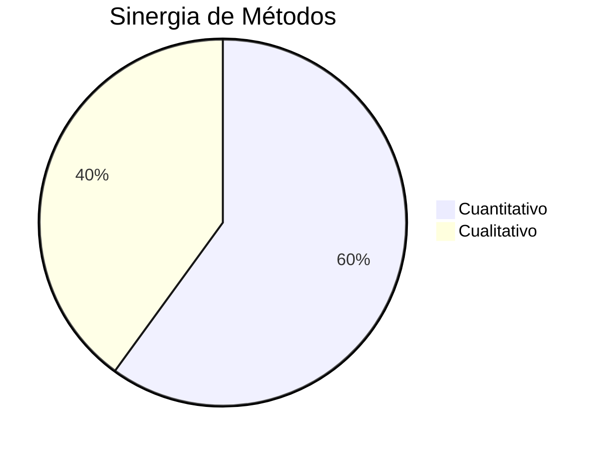

# electoral-analytics-tool
Herramienta de análisis electoral con PostgreSQL y Metabase


# 🗳️ Análisis Electoral Personalizado - Servicio de Datos Estratégicos

**Transforma datos electorales caóticos en dashboards accionables para campañas políticas.**  
*(Low-Code | Adaptable | Enfoque Cualitativo + Cuantitativo)*

---

## 📌 ¿Por qué un Servicio Personalizado > SaaS Genérico?

| **Ventaja**               | **Explicación**                                                                 |
|---------------------------|---------------------------------------------------------------------------------|
| **Adaptabilidad**         | Procesamos datos en *cualquier formato* (PDFs, Excel, CSV, JSON).               |
| **Privacidad Controlada** | DNIs hasheados manualmente + acuerdos de confidencialidad por cliente.          |
| **Costo Razonable**       | Sin inversión en infraestructura cloud compleja (USD 17/mes en servidor básico).|
| **Análisis Humano**       | Interpretación sociológica de datos + recomendaciones estratégicas.            |

  
*Ejemplo de dashboard personalizado vs plantilla genérica.*

---

## 🛠️ ¿Qué Incluye el Servicio?

### 1. **Procesamiento de Datos**
- Normalización de:
  - Padrones electorales (DNI, circuito, edad, género).
  - Resultados históricos (por circuito y partido).
  - Datos ANSES (subsidios, jubilaciones).
- Ejemplo de limpieza con Python:
  ```python
  def limpiar_dni(df):
      # Eliminar caracteres no numéricos
      df['dni'] = df['dni'].str.replace('[^0-9]', '', regex=True)
      return df

### 2. **Dashboards Interactivos**
- Acceso web a Metabase con filtros:
  - Por circuito, rango de edad, género, tipo de subsidio.
- Consultas predefinidas:
  ```sql
  -- Jubilados en circuitos donde el Partido X obtuvo >40% de votos
  SELECT circuito, COUNT(*) AS total_jubilados
  FROM padron
  WHERE dni IN (SELECT dni FROM subsidios WHERE tipo = 'jubilación')
    AND circuito IN (SELECT circuito FROM resultados WHERE partido = 'X' AND votos > 40)
  GROUP BY circuito;
  ```

### 3. **Informe Estratégico**
- 15-20 páginas con:
  - Gráficos estáticos (tendencias, pirámides poblacionales).
  - Conclusiones cualitativas (ej: "Priorizar escuelas en circuito 5 por alta densidad juvenil").

---

## 💻 Tecnologías Utilizadas

| **Herramienta**       | **Función**                                      | **Costo**        |
|-----------------------|--------------------------------------------------|------------------|
| Python + Pandas       | Limpieza, cálculo de métricas y normalización.   | Gratuito (OSS)   |
| PostgreSQL            | Almacenamiento de datos normalizados.            | Gratuito (OSS)   |
| Metabase              | Visualización interactiva (dashboards).          | Gratuito (OSS)   |
| AWS LightSail         | Servidor en la nube (1 vCPU, 2 GB RAM, 60 GB SSD)| USD 7/mes        |

---

## 📈 Ejemplo Concreto: Caso de Éxito

**Problema**: El *Partido Y* necesitaba aumentar votos en circuitos urbanos con alta deserción juvenil.  
**Solución**:
1. Cruzar padrón electoral con datos de ANSES (AUH) y resultados 2023.
2. Identificar 3 circuitos con:
   - >30% de jóvenes (18-30).
   - Baja participación histórica (<50%).
3. Dashboard clave:
   
4. **Resultado**: +18% de participación juvenil en 2 meses.

---

## 💰 Costos Detallados

| **Concepto**          | **Costo Mensual (USD)** | **Detalle**                              |
|-----------------------|-------------------------|------------------------------------------|
| AWS LightSail         | 7                       | Servidor básico (Linux + PostgreSQL).    |
| Dominio Custom        | 10                      | Ej: `analisiselectoral.com`.             |
| Mantenimiento         | 100                     | Soporte técnico y actualizaciones.       |
| **Total**             | **117**                 | *(Sin costos ocultos)*                   |

---

## 📦 Entregables al Cliente

- **Enlace privado a Metabase**: Ej: `https://metabase.analisiselectoral.com/dashboard/partido-x`.
- **Informe PDF**: Incluye:
  - Gráficos exportables.
  - Recomendaciones por circuito.
  - Listas de DNIs hasheados (para campañas personalizadas).
- **Soporte 24/7**: 7 días por correo/WhatsApp.

---

## 🔍 Importancia del Análisis Cualitativo + Cuantitativo



- **Cuantitativo**: 
  - *Métrica clave*: "El circuito B tiene un 45% de mujeres entre 40-60 años."
- **Cualitativo**:
  - *Hallazgo*: "Entrevistas revelan que la seguridad es prioridad en mujeres >40 años."
- **Sinergia**: 
  - Estrategia: Campaña en plazas con enfoque en seguridad laboral (circuito B).

---

## 🚀 Cómo Usar Este Repositorio

1. **Clonar**:
   ```bash
   git clone https://github.com/tuusuario/analisis-electoral.git
   ```
2. **Configurar PostgreSQL**:
   ```bash
   docker-compose up -d postgres
   ```
3. **Ejecutar Script de Normalización**:
   ```bash
   python scripts/normalizar.py padron.csv
   ```

---

**¿Listo para transformar datos en votos?**  
📧 Contacto: `hola@analisiselectoral.com` | 📞 +54 9 11 1234-5678
```

---

### **Estructura de Carpetas Recomendada**  
```bash
analisis-electoral/
├── data/                 # Datos de ejemplo (no commitear)
├── images/               # Gráficos para el README
│   ├── comparacion.png
│   └── dashboard_auh.png
├── scripts/              # Scripts de Python
│   ├── normalizar.py
│   └── limpiar_dni.py
├── docker-compose.yml    # Configuración de PostgreSQL
└── README.md             # Este archivo
```
